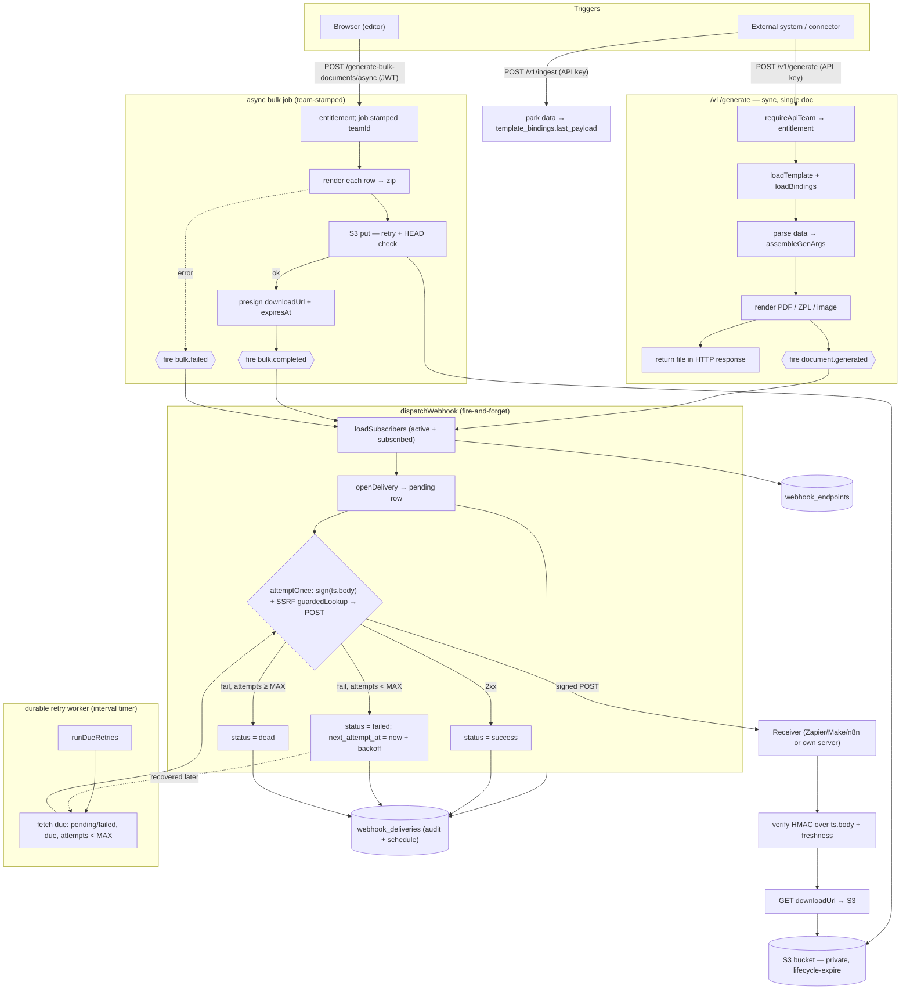
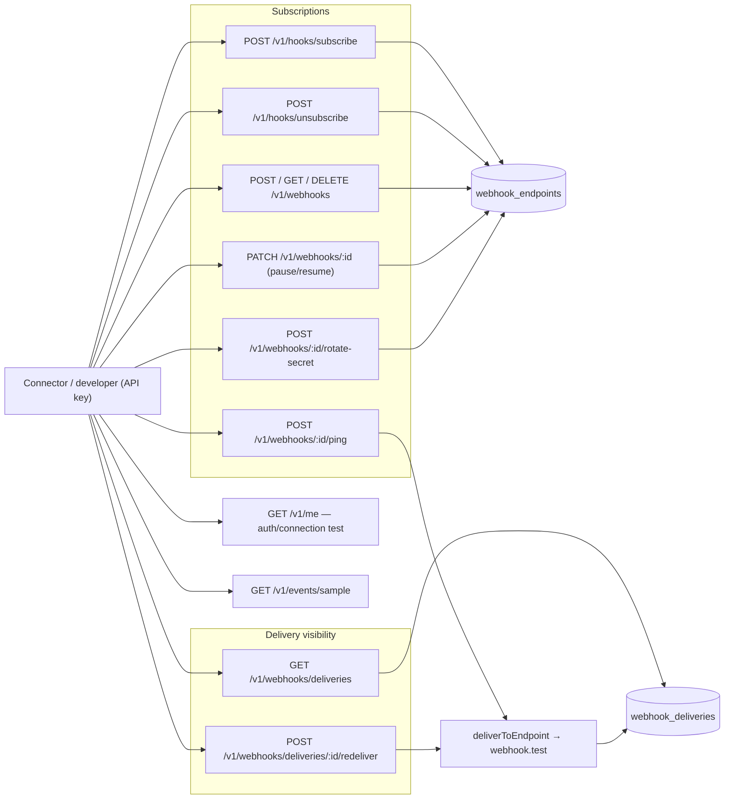

# Webhook & Connector — Flow Diagrams

Visual companion to `WEBHOOK_CONNECTOR_ARCHITECTURE.md`. Two views: the runtime
delivery flow, and the management API. Diagrams are Mermaid (renders on GitHub /
VS Code preview / any Mermaid viewer).

## 1. Runtime: trigger → generate → store → deliver → retry

## 2. Management API (all API-key authed, tenant-scoped)

## Legend / notes

- `{{ }}` = an event fired into the dispatcher; `( )` = a data store; `{ }` = the
  single-attempt decision point.
- The **same `attemptOnce`** is reached from both the inline dispatch and the
  retry worker — that's why retries are durable (state in `webhook_deliveries`,
  not memory).
- The SSRF guard sits inside `attemptOnce` (`guardedLookup`) and at
  subscribe/create time (`assertPublicUrl`).
- Step mapping: sync generate = Step 1; S3 store = Step 2; dispatcher + audit =
  Step 3; `/v1/me` + hooks + sample = Step 4. See
  `WEBHOOK_CONNECTOR_ARCHITECTURE.md` for detail.
